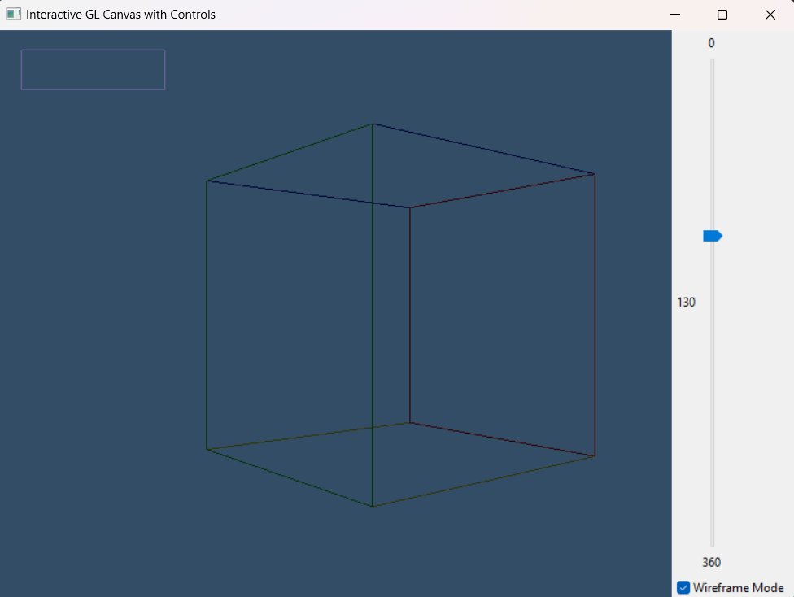

# Interactive GL Canvas with Controls



A wxWidgets application featuring an OpenGL canvas with interactive controls, demonstrating seamless integration between wxWidgets UI and OpenGL rendering.

## Features

- 🎨 OpenGL 3D scene with rotating colored cube
- 🖱️ Overlay button rendered directly in OpenGL
- 🎛️ Interactive control panel:
  - Rotation angle slider
  - Wireframe mode toggle
- 🔄 Real-time UI-to-render synchronization

## Requirements

| Platform       | Dependencies |
|----------------|--------------|
| Windows        | wxWidgets 3.0+, OpenGL |
| Linux          | wxGTK3-dev, freeglut3-dev |
| macOS          | wxWidgets (via Homebrew) |

## Installation

### Windows
Using vcpkg
vcpkg install wxwidgets
cmake -B build -DCMAKE_TOOLCHAIN_FILE=[vcpkg root]/scripts/buildsystems/vcpkg.cmake
cmake --build build

### Linux
sudo apt-get install libwxgtk3.0-gtk3-dev freeglut3-dev
git clone https://github.com/harryDeane/wxWidget-Model.git
cd interactive-gl-canvas
mkdir build && cd build
cmake ..
make

### Mac OS
brew install wxwidgets
git clone https://github.com/harryDeane/wxWidget-Model.git
cd interactive-gl-canvas
mkdir build && cd build
cmake -DCMAKE_BUILD_TYPE=Release ..
make

## Usage Instructions

### Launching the Application
1. Run the compiled executable
2. The main window will show:
   - OpenGL canvas (left)
   - Control panel (right, initially hidden)

### Interacting with Controls
```plaintext
[Show Controls] button (OpenGL-rendered):
- Click to toggle control panel visibility
- Changes text based on current state
- Highlights on mouse hover

Control Panel Elements:
┌───────────────────────┐
│ Rotation: [0─────360]  │
│ Wireframe: [✓]        │
└───────────────────────┘
